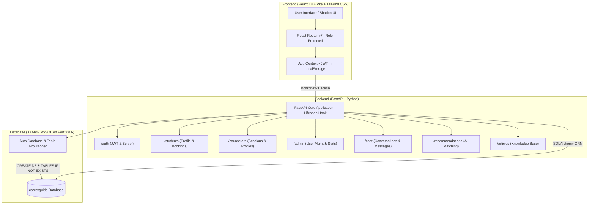
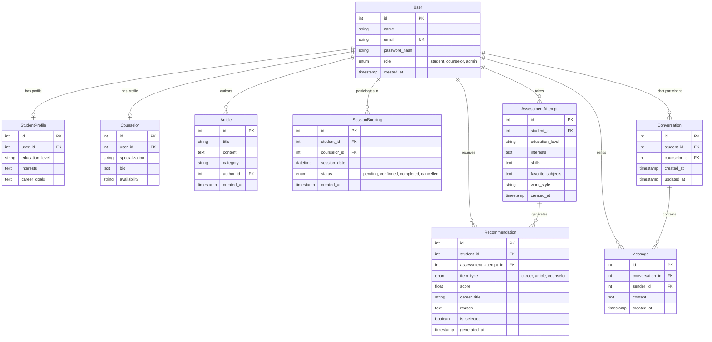

# 🧭 CareerPath AI — Project Structure & How It Works

Welcome to the **CareerPath AI** (CareerGuide) codebase! This document provides a complete, easy-to-understand guide to how the project is structured, how each component works, and how the frontend, backend, and XAMPP MySQL database communicate with each other.

---

## 📌 Table of Contents
1. [What is CareerPath AI?](#1-what-is-careerpath-ai)
2. [High-Level System Architecture](#2-high-level-system-architecture)
3. [Workspace Layout & File Organization](#3-workspace-layout--file-organization)
   - [Post-Cleanup Repository Structure](#post-cleanup-repository-structure)
   - [Full Directory Tree](#full-directory-tree)
4. [Frontend Architecture (`CareerGuideComp/src`)](#4-frontend-architecture)
   - [Tech Stack](#frontend-tech-stack)
   - [State Management & Authentication](#state-management--authentication)
   - [Routing & Role-Based Access Control](#routing--role-based-access-control)
   - [Page-by-Page Breakdown](#page-by-page-breakdown)
5. [Backend Architecture (`CareerGuideComp/backend`)](#5-backend-architecture)
   - [Tech Stack](#backend-tech-stack)
   - [API Routers & Endpoints](#api-routers--endpoints)
   - [XAMPP MySQL & Auto-Database Creation](#xampp-mysql--auto-database-creation)
   - [Authentication & Security](#authentication--security)
   - [AI Recommendation Engine](#ai-recommendation-engine)
6. [Database Schema & Data Relationships](#6-database-schema--data-relationships)
7. [User Roles & Permissions Matrix](#7-user-roles--permissions-matrix)
8. [How to Run the Project (Step-by-Step)](#8-how-to-run-the-project-step-by-step)
   - [1. Backend Setup (FastAPI + XAMPP MySQL)](#1-backend-setup-fastapi--xampp-mysql)
   - [2. Frontend Setup (React + Vite)](#2-frontend-setup-react--vite)
   - [3. Default Test Credentials](#3-default-test-credentials)
9. [Summary & Maintenance Guide](#9-summary--maintenance-guide)

---

## 1. What is CareerPath AI?

**CareerPath AI** is an intelligent career guidance and mentorship web platform. It helps students discover suitable career paths, connect with professional career counselors, book 1-on-1 counseling sessions, chat in real time, and explore career roadmaps and resources.

### Key Capabilities:
- 🤖 **AI Career Recommendations**: Students submit their educational background, skills, interests, and working styles. An automated matching engine analyzes their profile against career archetypes and suggests top career paths with match percentages and reasoning.
- 🗺️ **Step-by-Step Roadmaps**: Actionable milestones, checklists, learning resources, and PDF export for chosen careers.
- 📅 **Counselor Booking System**: Students can book future 1-on-1 counseling sessions with certified counselors.
- 💬 **Counselor Chat**: Direct in-app messaging between students and counselors.
- 📚 **Career Articles & Insights**: Counselors and admins publish informative articles categorized by domain (Tech, Business, Healthcare, etc.).
- 🛡️ **Role-Based Portals**: Tailored interfaces for **Guests**, **Students**, **Counselors**, and **Administrators**.

---

## 2. High-Level System Architecture

The platform follows a modern decoupled **Single-Page Application (SPA) + RESTful API** architecture:



---

## 3. Workspace Layout & File Organization

### Post-Cleanup Repository Structure

The workspace has been refactored and cleaned to eliminate redundant files:
- **Clean Root**: All obsolete static prototype `.html` files, styling directories, and abandoned duplicate files in the root have been removed.
- **Git Optimization**: Over 65,000 accidental dependency files have been removed from Git tracking, and a comprehensive `.gitignore` prevents future clutter.
- **Root Convenience**: The root `package.json` now acts as a runner proxy, allowing commands like `npm run dev` to be run directly from the root workspace.
- **Active Codebase**: All full-stack code lives neatly inside `CareerGuideComp/` (`src/` for frontend, `backend/` for backend).

---

### Full Directory Tree

```text
Career-Guide/
│
├── .gitignore                        # Global ignore rules (node_modules, .env, __pycache__, dist)
├── package.json                      # Root workspace proxy scripts (npm run dev)
├── PROJECT_STRUCTURE.md              # 📖 This architecture & system documentation
├── README.md                         # Project quickstart guide
│
└── CareerGuideComp/                  ⭐ ACTIVE APPLICATION DIRECTORY
    │
    ├── backend/                      🐍 FastAPI Backend
    │   ├── app/
    │   │   ├── __init__.py
    │   │   ├── auth.py               # Direct Bcrypt hashing, JWT token logic & role guards
    │   │   ├── database.py           # Auto-DB creation, SQLAlchemy pure-Python engine & session factory
    │   │   ├── main.py               # FastAPI app, CORS middleware & lifespan auto-init hook
    │   │   ├── models.py             # 9 SQLAlchemy ORM database models
    │   │   ├── schemas.py            # Pydantic request/response validation schemas
    │   │   └── routers/              # Modular REST API endpoints
    │   │       ├── admin.py          # Admin actions (stats, user management, counselor creation)
    │   │       ├── articles.py       # Article CRUD endpoints
    │   │       ├── auth.py           # Registration (/signup), Login (/login), /me
    │   │       ├── chat.py           # Counselor-student messaging endpoints
    │   │       ├── counselors.py     # Counselor directory & session status updates
    │   │       ├── recommendations.py# AI career assessment & matching algorithm
    │   │       └── students.py       # Student profile & session booking management
    │   │
    │   ├── .env                      # Database credentials (XAMPP root / empty password)
    │   ├── requirements.txt          # Python package requirements
    │   ├── create_test_admin.py      # Seed script: creates or resets an admin user
    │   ├── create_test_counselor.py  # Seed script: creates a sample counselor
    │   └── test_models.py            # Diagnostic script verifying all 9 MySQL tables
    │
    ├── src/                          ⚛️ React Frontend
    │   ├── app/
    │   │   ├── App.tsx               # Root App component wrapping AuthProvider & RouterProvider
    │   │   ├── Root.tsx              # Main layout: responsive navigation bar & footer
    │   │   ├── routes.tsx            # Route definitions and role-based route guards
    │   │   ├── context/
    │   │   │   └── AuthContext.tsx   # Global authentication state, login, signup, logout
    │   │   ├── pages/                # Page components
    │   │   │   ├── AdminDashboard.tsx     # Admin console (metrics, user table, counselor creation)
    │   │   │   ├── ArticlesPage.tsx       # Browse & filter career articles
    │   │   │   ├── CounselorDashboard.tsx # Counselor portal (session requests, write articles, chat)
    │   │   │   ├── CounselorsPage.tsx     # Browse & filter verified counselors, book slots
    │   │   │   ├── GuestHome.tsx          # Public marketing landing page
    │   │   │   ├── LoginPage.tsx          # User login page
    │   │   │   ├── SignupPage.tsx         # Student registration page
    │   │   │   └── StudentDashboard.tsx   # Student portal (AI assessment, roadmaps, sessions, chat)
    │   │   └── components/
    │   │       ├── figma/                 # Specialized UI components (ImageWithFallback)
    │   │       └── ui/                    # 40+ Shadcn / Radix UI design system components
    │   │                                  # (buttons, dialogs, cards, dropdowns, inputs, etc.)
    │   ├── imports/                  # Imported static assets (e.g. Comprehensive_Career_Guide.pdf)
    │   ├── styles/                   # Styling system
    │   │   ├── index.css             # Base styles
    │   │   ├── tailwind.css          # Tailwind CSS configuration
    │   │   └── theme.css             # Theme color variables & design tokens
    │   ├── main.tsx                  # React DOM entry point
    │   └── vite.config.ts            # Vite bundler configuration & asset resolvers
    │
    ├── .env                          # Frontend environment variables (VITE_API_URL)
    ├── ATTRIBUTIONS.md               # Asset attributions
    ├── index.html                    # Single-page HTML document for Vite
    ├── package.json                  # Frontend dependencies and npm scripts
    ├── postcss.config.mjs            # PostCSS configuration
    └── README.md                     # Application bundle notes
```

---

## 4. Frontend Architecture

### Frontend Tech Stack
- **Library**: React 18 with TypeScript
- **Build Tool**: Vite 6
- **Routing**: React Router v7 (`createBrowserRouter`, `RouterProvider`)
- **Styling**: Tailwind CSS v4 & PostCSS
- **UI Primitives**: Radix UI (`@radix-ui/react-*`) & Shadcn UI
- **Icons**: Lucide React
- **Animations**: Motion (Framer Motion)
- **Charts & Data Viz**: Recharts

---

### State Management & Authentication

Authentication state is managed globally through `AuthContext.tsx`:
- **Persistence**: When a user logs in or signs up, the backend returns a JWT `access_token` and user object. These are stored in `localStorage` under the key `careerguide_auth`.
- **Auto-verification**: On page load, `AuthProvider` calls `GET /auth/me` with the stored Bearer token to verify whether the session is still active and valid.
- **Session expiry**: If the token is invalid or expired, the local session is cleared and the user returns to the `guest` state.

```typescript
// Role definition in AuthContext.tsx
export type Role = "guest" | "student" | "counselor" | "admin";
```

---

### Routing & Role-Based Access Control

The application routes are defined in `CareerGuideComp/src/app/routes.tsx` and enforce strict role protection:

| URL Path | Permitted Roles | Component | Description |
| :--- | :--- | :--- | :--- |
| `/` | Anyone (Guest, Student, Counselor, Admin) | `GuestHome` | Public landing page |
| `/articles` | Anyone | `ArticlesPage` | Career articles and guides |
| `/counselors` | Anyone | `CounselorsPage` | Directory of counselors with booking modals |
| `/login` | Public Only (Guests) | `LoginPage` | User login (redirects logged-in users to their dashboard) |
| `/signup` | Public Only (Guests) | `SignupPage` | Registration (redirects logged-in users to their dashboard) |
| `/student` | **Student Only** | `StudentDashboard` | Protected student workspace |
| `/counselor` | **Counselor Only** | `CounselorDashboard` | Protected counselor workspace |
| `/admin` | **Admin Only** | `AdminDashboard` | Protected system administration console |

#### How Role Guards Work:
- **`RequireRole` wrapper**: If an unauthenticated user visits `/student`, they are redirected to `/login`. If a logged-in user with the wrong role visits a page (e.g. a student visits `/admin`), they are redirected to their own appropriate dashboard via `DashboardRedirect`.
- **`PublicOnly` wrapper**: Prevents already-authenticated users from re-visiting `/login` or `/signup`.

---

### Page-by-Page Breakdown

#### 1. Landing Page (`GuestHome.tsx`)
- Hero section explaining the platform value proposition.
- Quick platform statistics (50K+ Students, 200+ Counselors, 95% Satisfaction).
- Feature highlights (AI matching, counselor sessions, career roadmaps).
- Call-to-action buttons leading to signup or assessment.

#### 2. Student Dashboard (`StudentDashboard.tsx`)
Contains 5 functional tabs:
1. **AI Guide (`ai-guide`)**: Assessment questionnaire where students input education level, interests, technical/soft skills, favorite subjects, and work styles. Submits to `/recommendations/generate` and displays top 3 matching careers with percentage scores and explanations. Allows selecting a career path.
2. **Roadmaps (`roadmaps`)**: Displays step-by-step career milestones (foundation, advanced skills, certifications, job readiness) with interactive check-off items and PDF download.
3. **Sessions (`sessions`)**: Displays all booked counseling appointments with live status pills (`pending`, `confirmed`, `completed`, `cancelled`) and an option to cancel upcoming bookings.
4. **Saved (`saved`)**: Bookmarked career paths and guides for quick reference.
5. **Chat (`chat`)**: Real-time messaging with career counselors.

#### 3. Counselor Dashboard (`CounselorDashboard.tsx`)
Contains 4 functional tabs:
1. **Students (`students`)**: View student appointment requests. Counselors can change status (`confirmed`, `completed`, `cancelled`).
2. **Content (`content`)**: Publish new career articles (title, category, content) and delete existing published articles.
3. **Chat (`chat`)**: Message student clients directly.
4. **Webinars (`webinars`)**: Host or schedule group video sessions.

#### 4. Admin Dashboard (`AdminDashboard.tsx`)
Contains 5 functional tabs:
1. **Accounts (`accounts`)**: Full table of all users across the system. Search and filter by role. Modal to provision new verified Counselor accounts.
2. **Stats (`stats`)**: Aggregated metrics: total users, student count, counselor count, admin count, session breakdown by status.
3. **Categories (`categories`)**: Career domain taxonomies.
4. **Reports (`reports`)**: Platform activity logs and exportable audit records.
5. **Feedback (`feedback`)**: User feedback and issue review.

---

## 5. Backend Architecture

### Backend Tech Stack
- **Framework**: FastAPI (Python 3.10+)
- **ORM**: SQLAlchemy 2.x
- **Database Engine**: MySQL (`mysql-connector-python` in pure Python mode)
- **Authentication**: JWT (JSON Web Tokens) via `python-jose`
- **Password Security**: Direct `bcrypt` hashing (72-byte safe)
- **Validation**: Pydantic v2 schemas
- **CORS**: Configured for local client origins (`http://localhost:5173`)

---

### API Routers & Endpoints

| Router Prefix | Tag | Description | Key Endpoints |
| :--- | :--- | :--- | :--- |
| `/auth` | Authentication | Account creation, login, session info | `POST /auth/signup`<br>`POST /auth/login`<br>`GET /auth/me` |
| `/students` | Students | Student profile & booking management | `GET /students/me`<br>`PUT /students/me`<br>`POST /students/sessions`<br>`GET /students/sessions`<br>`PATCH /students/sessions/{id}/cancel` |
| `/counselors` | Counselors | Public counselor list & session actions | `GET /counselors`<br>`GET /counselors/me/sessions`<br>`PATCH /counselors/me/sessions/{id}` |
| `/admin` | Admin | Administrative actions & metrics | `GET /admin/users`<br>`GET /admin/sessions`<br>`GET /admin/stats`<br>`POST /admin/counselors` |
| `/articles` | Articles | Knowledge base articles | `GET /articles`<br>`GET /articles/{id}`<br>`POST /articles`<br>`DELETE /articles/{id}` |
| `/recommendations` | Recommendations | AI assessment & career scoring | `POST /recommendations/generate`<br>`GET /recommendations/me`<br>`PATCH /recommendations/{id}/select` |
| `/chat` | Chat | Counselor-student messaging | `POST /chat/conversations`<br>`GET /chat/conversations`<br>`GET /chat/conversations/{id}`<br>`POST /chat/conversations/{id}/messages` |

---

### XAMPP MySQL & Auto-Database Creation

In standard setups, MySQL databases and tables often require manual creation or manual migration scripts. The backend now automates this entire process:

1. **Auto Database Creation (`ensure_database_exists`)**:
   - On startup, the backend connects to MySQL server without selecting a database.
   - Executes:
     ```sql
     CREATE DATABASE IF NOT EXISTS `careerguide` CHARACTER SET utf8mb4 COLLATE utf8mb4_unicode_ci;
     ```
2. **Auto ORM Table Creation (`init_db`)**:
   - Imports all models from `app.models` to register them with SQLAlchemy `Base`.
   - Executes `Base.metadata.create_all(bind=engine)` which automatically generates all 9 tables if they do not yet exist.
3. **FastAPI Lifespan Integration**:
   - Registered in `app.main:lifespan`, so running `uvicorn app.main:app` automatically validates and initializes the database before serving any incoming requests.
4. **Pure Python Mode (`connect_args={"use_pure": True}`)**:
   - Ensures the Python connector avoids Windows C-extension crashes, providing seamless integration with XAMPP MySQL.

---

### Authentication & Security

1. **Direct Bcrypt Hashing**: Passwords are encrypted using modern `bcrypt` with automatic salting and 72-byte truncation, completely avoiding legacy `passlib` compatibility bugs.
2. **Token Generation**: Upon successful login, an access token is issued containing the user ID as `sub` and an expiration timestamp (default: 24 hours).
3. **Dependency Injection Guards**:
   - `get_current_user`: Decodes Bearer token, fetches user from database, raises `401 Unauthorized` if invalid.
   - `require_role(*allowed_roles)`: Verifies that `current_user.role` matches authorized roles (e.g. only `"student"` can book sessions; only `"counselor"` or `"admin"` can publish articles).

---

### AI Recommendation Engine

The recommendation engine is implemented in `CareerGuideComp/backend/app/routers/recommendations.py`.

#### Scoring Mechanics:
1. **Career Archetypes**: A library of career profiles (Data Analyst, Backend Developer, ML Engineer, Frontend Developer, Cybersecurity Analyst, UX/UI Designer, Project Manager, Financial Analyst, etc.) with associated domain keywords.
2. **Input Normalization**: Student inputs (education level, interests, skills, subjects, work style) are cleaned of special characters.
3. **Keyword Overlap Matching**: The engine measures keyword intersections between student attributes and career profiles.
4. **Scoring Formula**:
   $$\text{Score} = \min(95, 45 + (\text{matched\_keywords} \times 9))$$
   *(Baseline match score is 35% if no keywords overlap, scaling up to 95%).*
5. **Contextual Reasoning**: Dynamic explanations are generated citing the specific matched skills and interests.
6. **Top Picks**: The top 3 ranked recommendations are persisted to the database and returned to the student.

---

## 6. Database Schema & Data Relationships

The database is built on MySQL using SQLAlchemy ORM models defined in `CareerGuideComp/backend/app/models.py`:



---

## 7. User Roles & Permissions Matrix

| Capability | Guest | Student | Counselor | Admin |
| :--- | :---: | :---: | :---: | :---: |
| Browse Landing Page & Counselors Directory | ✅ | ✅ | ✅ | ✅ |
| Read Published Career Articles | ✅ | ✅ | ✅ | ✅ |
| Take AI Assessment & View Recommendations | ❌ | ✅ | ❌ | ❌ |
| Select Target Career & Follow Roadmaps | ❌ | ✅ | ❌ | ❌ |
| Book 1-on-1 Counselor Sessions | ❌ | ✅ | ❌ | ❌ |
| Direct Chat with Counselors | ❌ | ✅ | ✅ | ❌ |
| Confirm, Complete, or Cancel Student Bookings | ❌ | ❌ | ✅ | ❌ |
| Author & Publish Articles | ❌ | ❌ | ✅ | ✅ |
| View System Analytics & Metrics | ❌ | ❌ | ❌ | ✅ |
| Create Verified Counselor Accounts | ❌ | ❌ | ❌ | ✅ |
| View All User Accounts & Session Audit Logs | ❌ | ❌ | ❌ | ✅ |

---

## 8. How to Run the Project (Step-by-Step)

Follow these instructions to run the entire system locally on your machine.

### 1. Backend Setup (FastAPI + XAMPP MySQL)

#### Prerequisites:
- Python 3.10+
- **XAMPP**: Ensure **MySQL** (port 3306) is started in the XAMPP Control Panel.

#### Steps:
1. Open a terminal and navigate to the backend directory:
   ```bash
   cd CareerGuideComp/backend
   ```

2. Activate or create your Python virtual environment:
   ```bash
   # Windows (PowerShell)
   .\venv\Scripts\activate
   ```

3. Install the dependencies using `requirements.txt`:
   ```bash
   pip install -r requirements.txt
   ```

4. Verify the `.env` file (`CareerGuideComp/backend/.env`):
   ```env
   DB_USER=root
   DB_PASSWORD=
   DB_HOST=localhost
   DB_PORT=3306
   DB_NAME=careerguide
   JWT_SECRET=change_this_to_a_long_private_random_string_2026
   ```
   *(For default XAMPP setups, `DB_USER=root` with an empty `DB_PASSWORD=` is standard).*

5. Verify database tables and seed test accounts:
   ```bash
   # Verify that all 9 tables exist in MySQL:
   python test_models.py

   # Seed default administrator account:
   python create_test_admin.py

   # Seed default counselor account:
   python create_test_counselor.py
   ```

6. Start the FastAPI development server:
   ```bash
   python -m uvicorn app.main:app --reload --port 8000
   ```
   - API Base URL: `http://127.0.0.1:8000`
   - Interactive Swagger API Docs: `http://127.0.0.1:8000/docs`

---

### 2. Frontend Setup (React + Vite)

#### Prerequisites:
- Node.js (v18 or higher)
- npm (v9 or higher)

#### Steps:
1. Open a second terminal in the project root:
   ```bash
   # You can run directly from root:
   npm run dev

   # Or from inside CareerGuideComp:
   cd CareerGuideComp
   npm run dev
   ```

2. Open your browser and navigate to:
   ```text
   http://localhost:5173
   ```

---

### 3. Default Test Credentials

| Role | Email | Password | Access URL |
| :--- | :--- | :--- | :--- |
| **Admin** | `admin@example.com` | `AdminTest123` | `http://localhost:5173/login` |
| **Counselor** | `counselor@example.com` | `CounselorTest123` | `http://localhost:5173/login` |
| **Student** | *(Sign up at `/signup`)* | *(Your chosen password)* | `http://localhost:5173/signup` |

---

## 9. Summary & Maintenance Guide

- **Clean Architecture**: The codebase is cleanly separated into a React frontend (`CareerGuideComp/src`) and a FastAPI backend (`CareerGuideComp/backend`).
- **Zero-Configuration Database**: When the backend server starts up, it automatically provisions the `careerguide` database and all 9 ORM tables inside your local XAMPP MySQL server.
- **Git Friendly**: With `.gitignore` in place and all obsolete prototypes removed, the repository is lightweight, fast, and ready for version control.
